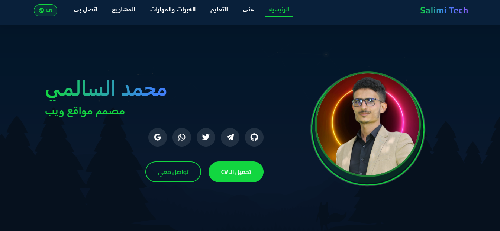
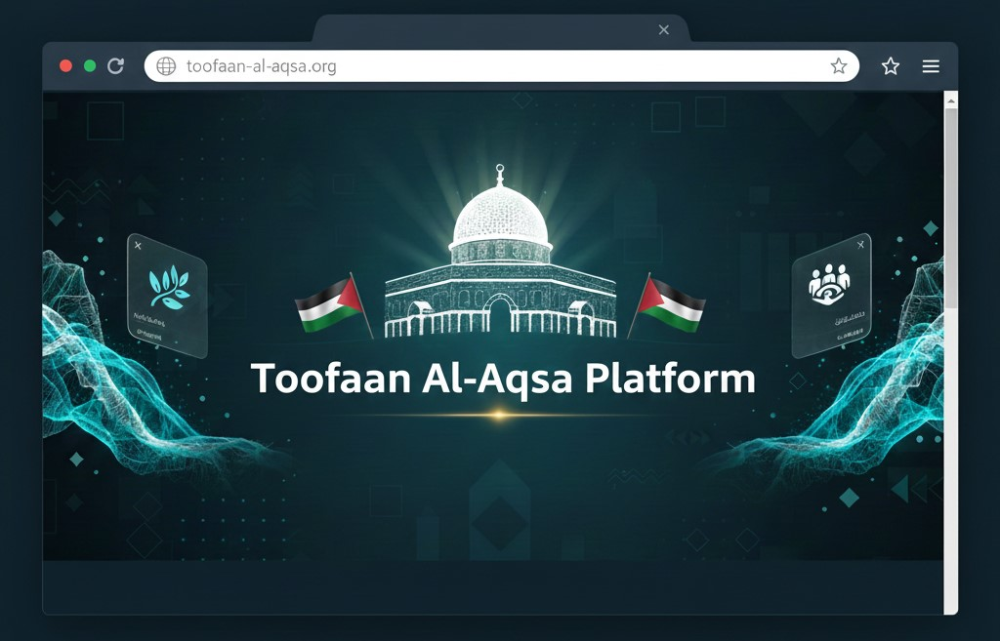
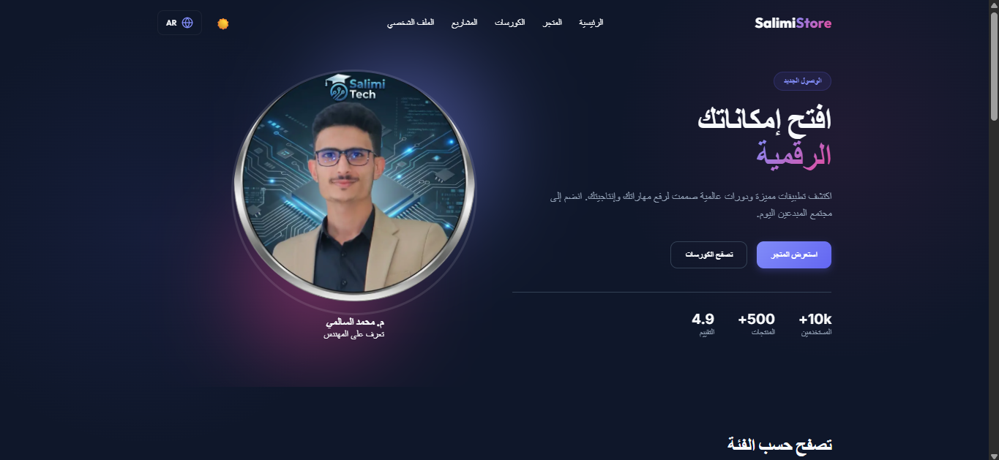
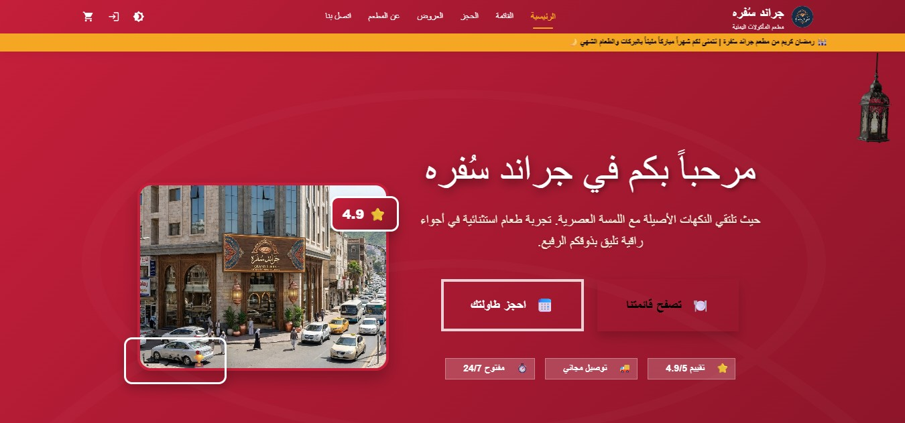
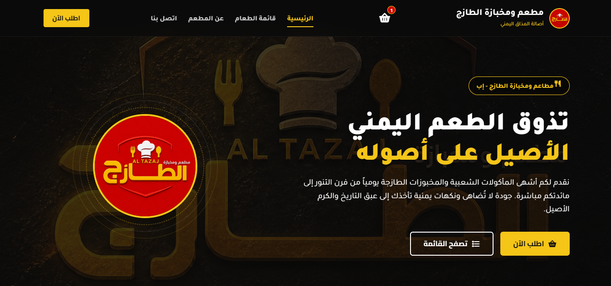
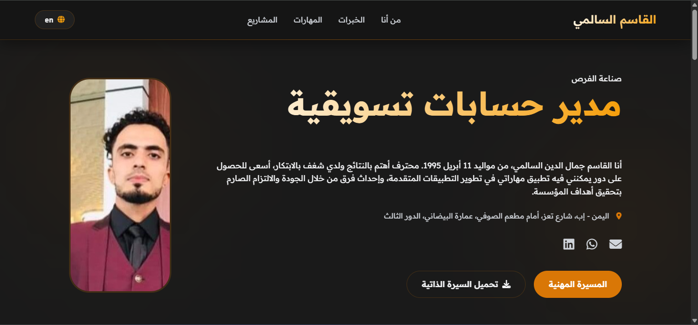
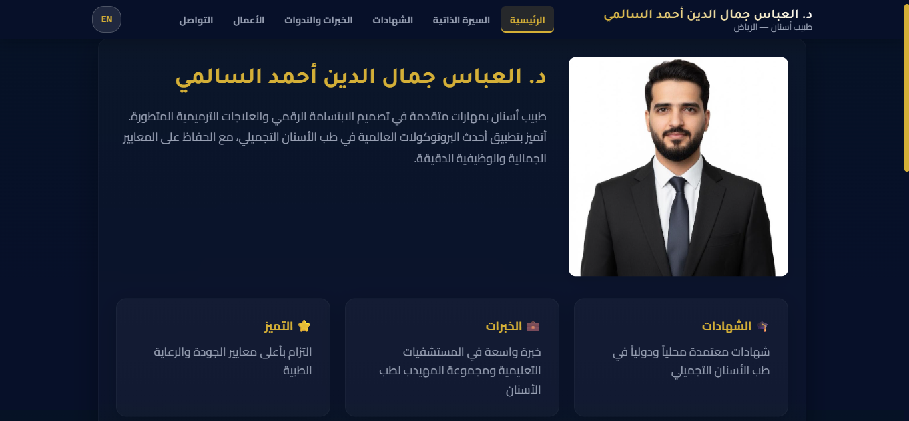

# <p align="center">مرحبًا بك في عالمي الرقمي! 👋</p>
<p align="center">
  
</p>


<p align="center">
  
</p>

<p align="center">
  <a href="https://github.com/malsalimi">
    
  </a>
  
  
  
</p>

---

## 👤 نبذة عني

> أنا **محمد جمال الدين السالمي**، تقني ومختص أمن سيبراني ومطور برمجيات من **الجمهورية اليمنية**. شغوف بحماية الأنظمة والشبكات، وأعشق بناء أدوات وتطبيقات متكاملة تدمج بين الجانب البرمجي والأمني لتقديم تجربة رقمية آمنة وفعالة.

* 🌐 **الموقع الشخصي للحقيبة البرمجية:** [Salimi Tech](https://salimi-tech.vercel.app/)
* 💼 **الاهتمامات الحالية:** اختبار الاختراق الأخلاقي، إدارة وتأمين شبكات MikroTik، وتطوير تطبيقات الهواتف الذكية والويب.
* ✉️ **البريد الإلكتروني للاتصال المباشر:** [salimitech2025@gmail.com](mailto:salimitech2025@gmail.com)

<p align="center">
  
</p>

---

## 🛠️ المهارات والتقنيات (Toolbox)

<table align="center" width="100%">
  <tr>
    <td align="center" width="33%">
      <h3>💻 لغات البرمجة</h3>
      <br/>
      <br/>
      <br/>
      <br/>
      <br/>
      <br/>
      <br/>
      
    </td>

```
<td align="center" width="33%">
  <h3>🌐 تطوير الويب والتطبيقات</h3>
  <br/>
  <br/>
  <br/>
  <br/>
  <br/>
  <br/>
  <br/>
  
</td>

<td align="center" width="33%">
  <h3>🛡️ الأمن السيبراني والشبكات</h3>
  <br/>
  <br/>
  <br/>
  <br/>
  <br/>
  <br/>
  <br/>
  
</td>
```

  </tr>

  <tr>
    <td align="center" width="33%">
      <h3>🛠️ الأدوات وبيئات التطوير</h3>
      <br/>
      <br/>
      <br/>
      <br/>
      <br/>
      <br/>
      <br/>
      
    </td>

```
<td align="center" width="33%">
  <h3>☁️ الاستضافة والنشر</h3>
  <br/>
  <br/>
  <br/>
  <br/>
  <br/>
  <br/>
  
</td>

<td align="center" width="33%">
  <h3>🤖 الذكاء الاصطناعي والأتمتة</h3>
  <br/>
  <br/>
  <br/>
  <br/>
  <br/>
  <br/>
  <br/>
  
</td>
```

  </tr>

  <tr>
    <td align="center" width="33%">
      <h3>📱 تطوير Android وFlutter</h3>
      <br/>
      <br/>
      <br/>
      <br/>
      <br/>
      <br/>
      
    </td>

```
<td align="center" width="33%">
  <h3>🎬 صناعة المحتوى الرقمي</h3>
  <br/>
  <br/>
  <br/>
  <br/>
  <br/>
  <br/>
  <br/>
  
</td>

<td align="center" width="33%">
  <h3>🔐 التطوير الآمن والهندسة</h3>
  <br/>
  <br/>
  <br/>
  <br/>
  <br/>
  <br/>
  <br/>
  
</td>
```

  </tr>
</table>

---

## 📂 معرض المشاريع الكامل (Projects Portfolio)

### 🌐 أولاً: مواقع وتطبيقات الويب (Websites & Web Apps)

#### 💎 سلسلة تطبيقات Next.js الحديثة (Salimi Digital - SD Collection)

<table width="100%">
  <tr>
    <td width="50%" valign="top" align="center">
      <a href="https://github.com/malsalimi/sd-01-oriana-hotel" target="_blank">
        
      </a>
      <br/>
      <b>🏨 <a href="https://github.com/malsalimi/sd-01-oriana-hotel" target="_blank">sd-01-oriana-hotel</a></b>
      <br/>
      <b>فندق ومنتجع أوريانا الفاخر (Oriana Hotel)</b>
      <p align="right">تطبيق ويب فاخر 5 نجوم لحجز الأجنحة الملكية والسبا وخدمات الكونسيرج الملكية بتجربة ثنائية اللغة متكاملة (Next.js 15, TS, Tailwind CSS 4).</p>
    </td>
    <td width="50%" valign="top" align="center">
      <a href="https://github.com/malsalimi/sd-02-meezan-legal" target="_blank">
        
      </a>
      <br/>
      <b>⚖️ <a href="https://github.com/malsalimi/sd-02-meezan-legal" target="_blank">sd-02-meezan-legal</a></b>
      <br/>
      <b>ميزان للاستشارات القانونية والمحاماة</b>
      <p align="right">منصة خدمات قانونية احترافية لاستشارات الشركات، ومتابعة القضايا، وحجز الجلسات وحلول التحكيم القانوني.</p>
    </td>
  </tr>
  <tr>
    <td width="50%" valign="top" align="center">
      <a href="https://github.com/malsalimi/sd-03-abaad-architecture" target="_blank">
        
      </a>
      <br/>
      <b>🏛️ <a href="https://github.com/malsalimi/sd-03-abaad-architecture" target="_blank">sd-03-abaad-architecture</a></b>
      <br/>
      <b>أبعاد للتصميم المعماري والديكور الداخلي</b>
      <p align="right">منصة استعراض أعمال الهندسة المعمارية والتصميم الداخلي المودرن ومشاريع BIM بنظام تصفية تفاعلي فائق الجمال.</p>
    </td>
    <td width="50%" valign="top" align="center">
      <a href="https://github.com/malsalimi/sd-04-rouqi-perfumes" target="_blank">
        
      </a>
      <br/>
      <b>👑 <a href="https://github.com/malsalimi/sd-04-rouqi-perfumes" target="_blank">sd-04-rouqi-perfumes</a></b>
      <br/>
      <b>متجر عطور الروقي الفاخرة</b>
      <p align="right">متجر إلكتروني فاخر للعطور الشرقية والغربية بمكتشف العطور التفاعلي وتفكيك النوتات العطرية وسلة تسوق سريعة.</p>
    </td>
  </tr>
  <tr>
    <td width="50%" valign="top" align="center">
      <a href="https://github.com/malsalimi/sd-05-nawa-market" target="_blank">
        
      </a>
      <br/>
      <b>🛒 <a href="https://github.com/malsalimi/sd-05-nawa-market" target="_blank">sd-05-nawa-market</a></b>
      <br/>
      <b>سوق نوي الرقمي للمنتجات والسلع</b>
      <p align="right">منصة تجارة إلكترونية عصرية تحتوي على تصفية المنتجات، والتخفيضات السريعة، وسلة التسوق ولوحة تحكم تفاعلية.</p>
    </td>
    <td width="50%" valign="top" align="center">
      <a href="https://github.com/malsalimi/sd-06-almaaref-schools" target="_blank">
        
      </a>
      <br/>
      <b>🎓 <a href="https://github.com/malsalimi/sd-06-almaaref-schools" target="_blank">sd-06-almaaref-schools</a></b>
      <br/>
      <b>مدارس المعارف الأهلية النموذجية</b>
      <p align="right">منصة تعليمية للمدارس والمجمعات الأكاديمية تستعرض المناهج، والتسجيل الإلكتروني، وبوابة أولياء الأمور والطلاب.</p>
    </td>
  </tr>
  <tr>
    <td width="50%" valign="top" align="center">
      <a href="https://github.com/malsalimi/sd-07-careplus-medical-center" target="_blank">
        
      </a>
      <br/>
      <b>🏥 <a href="https://github.com/malsalimi/sd-07-careplus-medical-center" target="_blank">sd-07-careplus-medical-center</a></b>
      <br/>
      <b>مركز كير بلس الطبي التخصصي</b>
      <p align="right">بوابة طبية متطورة توفر حجز المواعيد مع الأطباء، ودليل العيادات التخصصية، وأرقام الطوارئ والتثقيف الصحي.</p>
    </td>
    <td width="50%" valign="top" align="center">
      <a href="https://github.com/malsalimi/sd-08-impact-digital-agency" target="_blank">
        
      </a>
      <br/>
      <b>🚀 <a href="https://github.com/malsalimi/sd-08-impact-digital-agency" target="_blank">sd-08-impact-digital-agency</a></b>
      <br/>
      <b>وكالة إمباكت للتسويق الرقمي والحلول البرمجية</b>
      <p align="right">معرض أعمال وكالة تسويق وحلول برمجية حديثة يستعرض خدمات البرمجة، واستراتيجيات SEO وتجارب UI/UX المستقبلية.</p>
    </td>
  </tr>
</table>

<br/>

#### 🌐 مشاريع وتطبيقات الويب الإضافية

<table width="100%">
  <tr>
    <td width="50%" valign="top" align="center">
      <a href="https://salimi-tech.vercel.app" target="_blank">
        
      </a>
      <br/>
      <b>💻 Salimi Tech Portfolio</b>
      <br/>
      🌐 <b><a href="https://salimi-tech.vercel.app" target="_blank">زيارة الموقع الرئيسي</a></b>
      <p align="right">الموقع الرسمي الشخصي وثنائي اللغة لاستعراض المهارات التقنية، ومشاريعي البرمجية، وشهاداتي المهنية.</p>
    </td>
    <td width="50%" valign="top" align="center">
      
      <br/>
      <b>🇵🇸 Tofan Al-Aqsa Platform</b>
      <br/>
      🚧 <i>قيد التطوير والترقية المستمرة</i>
      <p align="right">منصة ويب تفاعلية شاملة تقدم وثائق وخرائط تاريخية وأرشيفاً متكاملاً للتوعية بالقضية الفلسطينية.</p>
    </td>
  </tr>
  <tr>
    <td width="50%" valign="top" align="center">
      <a href="https://salimi-store.vercel.app/" target="_blank">
        
      </a>
      <br/>
      <b>🛒 متجر Salimi Store الرقمي</b>
      <br/>
      🌐 <b><a href="https://salimi-store.vercel.app/" target="_blank">زيارة الموقع المباشر</a></b>
      <p align="right">منصة ويب متطورة كمتجر إلكتروني متكامل لعرض وتحميل التطبيقات والالتحاق بالدورات التدريبية التقنية.</p>
    </td>
    <td width="50%" valign="top" align="center">
      <a href="https://grand-sofra-restaurant.vercel.app/" target="_blank">
        
      </a>
      <br/>
      <b>🍽️ Grand Sofra Restaurant Site</b>
      <br/>
      🌐 <b><a href="https://grand-sofra-restaurant.vercel.app/" target="_blank">زيارة الموقع المباشر</a></b>
      <p align="right">موقع ويب تفاعلي لمطعم "جراند سفرة" يعرض قائمة المأكولات اليمنية التقليدية ونظام طلبات وحجز ذكي.</p>
    </td>
  </tr>
  <tr>
    <td width="50%" valign="top" align="center">
      <a href="https://al-tazaj-restaurant.vercel.app/" target="_blank">
        
      </a>
      <br/>
      <b>🔥 Al-Tazaj Restaurant Website</b>
      <br/>
      🌐 <b><a href="https://al-tazaj-restaurant.vercel.app/" target="_blank">زيارة الموقع المباشر</a></b>
      <p align="right">موقع ويب للطلبات الفورية واستلام وتوصيل الوجبات وعرض الخصومات اليومية لمطعم ومخبازة الطازج.</p>
    </td>
    <td width="50%" valign="top" align="center">
      <a href="https://eng-alqasem-alsalemi.vercel.app/" target="_blank">
        
      </a>
      <br/>
      <b>📊 Eng. Alqasem Salimi Site</b>
      <br/>
      🌐 <b><a href="https://eng-alqasem-alsalemi.vercel.app/" target="_blank">زيارة الموقع المباشر</a></b>
      <p align="right">موقع ويب شخصي للمهندس القاسم السالمي كواجهة تفاعلية لعرض مسيرته وإنجازاته في تحليل البيانات والتسويق.</p>
    </td>
  </tr>
  <tr>
    <td width="50%" valign="top" align="center">
      <a href="https://dr-alabbas.vercel.app/" target="_blank">
        
      </a>
      <br/>
      <b>🦷 Dr. Alabbas Salimi Clinic</b>
      <br/>
      🌐 <b><a href="https://dr-alabbas.vercel.app/" target="_blank">زيارة الموقع المباشر</a></b>
      <p align="right">الموقع الرسمي للدكتور العباس السالمي بالرياض لعرض حالات العلاج وتقييمات المرضى.</p>
    </td>
    <td width="50%" valign="top" align="center">
      <!-- مساحة فارغة لموازنة التصميم الشبكي للمشروع الأخير -->
    </td>
  </tr>
</table>

---

### 📱 ثانياً: تطبيقات الموبايل والويندوز (Mobile & Desktop Apps)

<table width="100%">
  <tr>
    <td width="50%" valign="top" align="center">
      <a href="https://github.com/malsalimi/student-data-manager">
        
      </a>
      <br/>
      <b>📚 <a href="https://github.com/malsalimi/student-data-manager">student-data-manager (Mobile)</a></b>
      <p align="right">تطبيق الجوال (إصدار Flutter) لإدارة شؤون الطلاب، تسجيل الدرجات، الحضور وتوفير قاعدة بيانات محلية مرنة.</p>
    </td>
    <td width="50%" valign="top" align="center">
      <a href="https://github.com/malsalimi/student-system">
        
      </a>
      <br/>
      <b>🖥️ <a href="https://github.com/malsalimi/student-system">Student Data Manager (Windows)</a></b>
      <p align="right">نظام مكتبي متكامل (إصدار الويندوز) لإدارة بيانات الطلاب المالية والأكاديمية مصمم للمدارس والمعاهد التعليمية.</p>
    </td>
  </tr>
  <tr>
    <td width="50%" valign="top" align="center">
      <a href="https://github.com/malsalimi/file-processor">
        
      </a>
      <br/>
      <b>🔄 <a href="https://github.com/malsalimi/file-processor">File Processing & Analysis</a></b>
      <p align="right">تطبيق هاتف ذكي متعدد المهام لضغط، دمج، تحويل الملفات، واستخراج النصوص الفوري من الصور باستخدام تقنية OCR.</p>
    </td>
    <td width="50%" valign="top" align="center">
      <!-- مساحة إضافية -->
    </td>
  </tr>
</table>

---

### 🛡️ ثالثاً: مشاريع الأمن السيبراني والحماية (Cybersecurity Tools)

<table width="100%">
  <tr>
    <td width="50%" valign="top" align="center">
      <a href="https://github.com/malsalimi/link-scanner">
        
      </a>
      <br/>
      <b>🛡️ <a href="https://github.com/malsalimi/link-scanner">Trust Me (Link & File Scanner)</a></b>
      <p align="right">تطبيق حماية للموبايل يقوم بفحص عميق للروابط والملفات المرفوعة لكشف البرمجيات الخبيثة والتصيد بالتكامل مع VirusTotal API.</p>
    </td>
    <td width="50%" valign="top" align="center">
      <a href="https://github.com/malsalimi/ENCREYPTION-Project">
        
      </a>
      <br/>
      <b>🔐 <a href="https://github.com/malsalimi/ENCREYPTION-Project">Text & Message Encryption</a></b>
      <p align="right">نظام تشفير الرسائل والملفات يدعم خوارزميات AES-256 و RSA و Blowfish مع خاصية التدمير الذاتي للنصوص والرسائل.</p>
    </td>
  </tr>
</table>

---

## 📈 إحصائيات GitHub الحية (GitHub Stats)

<p align="center">
  
  
</p>

<p align="center">
  
</p>

<p align="center">
  
</p>

---

## 🤝 قنوات التواصل الاجتماعي (Let's Connect!)

<p align="center">
  <a href="https://www.linkedin.com/in/mohammedsalimi/" target="_blank">
    
  </a>
  <a href="https://wa.me/967736577725" target="_blank">
    
  </a>
  <a href="https://www.instagram.com/8m4.g" target="_blank">
    
  </a>
  <a href="https://www.facebook.com/share/1DZrP9su8P/" target="_blank">
    
  </a>
  <a href="https://t.me/albraa781" target="_blank">
    
  </a>
</p>

---

<p align="center">
  <i>إذا أعجبك أي مشروع في حسابي، لا تتردد في ترك ⭐ Star لدعم العمل! شكرًا لزيارتك 🤍</i>
</p>
